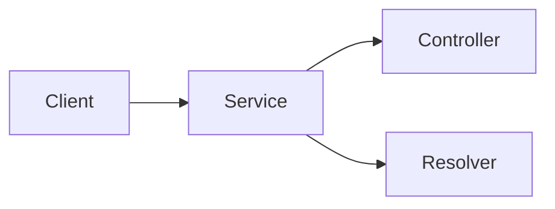

  

[circleci-image]: https://img.shields.io/circleci/build/github/nestjs/nest/master?token=abc123def456
[circleci-url]: https://circleci.com/gh/nestjs/nest

A progressive <a href="http://nodejs.org" target="_blank">Node.js</a> framework for building efficient and scalable server-side applications.

# Structure

### **Client** - Responsible for calling API, and some times to morph content
### **Service** - Responsible for data modeling
### **Controller** - Responsible for handling incoming rest requests and returning responses to the client
### **Resolver** - Responsible for handling incoming graphql requests and returning responses to the client

# Common
### **Operators:**
RxJs operators are the essential pieces that allow complex asynchronous code to be easily composed in a declarative manner.
### **Decorators:**
A Decorator is a special kind of declaration that can be attached to a class declaration, method, accessor, property, or parameter. Decorators use the form **@expression**, where expression must evaluate to a function that will be called at runtime with information about the decorated declaration.
### **Filters:**
Nest comes with a built-in exceptions layer which is responsible for processing all **unhandled exceptions** across an application.
### **Guards:**
Guards have a single responsibility. They determine whether a given request will be handled by the route handler or not, depending on certain conditions (like permissions, roles, ACLs, etc.) present at run-time.
### **Interceptors:**
Interceptors have a set of useful capabilities which are inspired by the **Aspect Oriented Programming (AOP)** technique. They make it possible to:
- bind extra logic before / after method execution
- transform the result returned from a function
- transform the exception thrown from a function
- extend the basic function behavior
- completely override a function depending on specific conditions (e.g., for caching purposes)
# Tests
### **Unit:**
Jest is a delightful JavaScript Testing Framework with a focus on simplicity.
### **e2e:**
Cucumber can be used to implement automated tests based on scenarios described in your Gherkin feature files.

# Documentation
### **Swagger:**
Swagger is an Interface Description Language for describing RESTful APIs expressed using JSON.
### **Playground:**
GraphQL IDE for better development workflows (GraphQL Subscriptions, interactive docs & collaboration).
